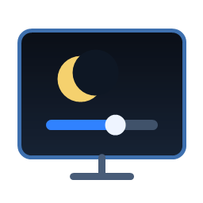

# Night Run Dimmer



Version: `0.2.0`

Windows 11 desktop tool for overnight agent runs. It dims every connected screen with a click-through black overlay, and can optionally try DDC/CI hardware brightness on monitors that support it.

## Why

Long-running local AI/agent jobs often run overnight. Night Run Dimmer keeps the machine awake while reducing screen light across every connected display.

## Run

```powershell
C:\code\night-run-dimmer\bin\Release\net8.0-windows\win-x64\publish\NightRunDimmer.exe
```

Desktop shortcut:

```text
C:\Users\pc\Desktop\Night Run Dimmer.lnk
```

## Controls

- `Night 75%`: turn on all-screen dimming and keep the system awake.
- `Restore`: remove visual dimming and restore captured DDC/CI brightness values.
- `All-screen visual dim`: reliable software dimming for every Windows screen.
- `Hardware DDC/CI`: optional real monitor brightness control, only for supported monitors.
- `Keep system awake`: prevents Windows from sleeping during overnight runs.
- `Ctrl+Shift+D`: toggle visual dimming.

Closing the window hides it to the tray. Use the tray menu `Exit` to quit.

## Build

Requirements:

- Windows 10/11
- .NET 8 SDK or newer

```powershell
dotnet build
dotnet publish -c Release -r win-x64 --self-contained false -p:PublishSingleFile=true -p:PublishReadyToRun=false
```

The published executable is written to:

```text
bin\Release\net8.0-windows\win-x64\publish\NightRunDimmer.exe
```

## Icon

The app icon is generated from `tools\Generate-AppIcon.ps1`:

```powershell
powershell.exe -NoProfile -ExecutionPolicy Bypass -File .\tools\Generate-AppIcon.ps1
```

Generated assets live under `assets\`.

## Notes

The overlay method is the default because it works on all displays, including monitors that do not expose DDC/CI brightness. DDC/CI is intentionally opt-in because some external monitors respond slowly or unreliably.

Performance note: the app does not poll DDC/CI on the UI thread. Hardware brightness writes are debounced and run in the background, so normal visual dimming remains responsive even on slow monitors.

## License

MIT
